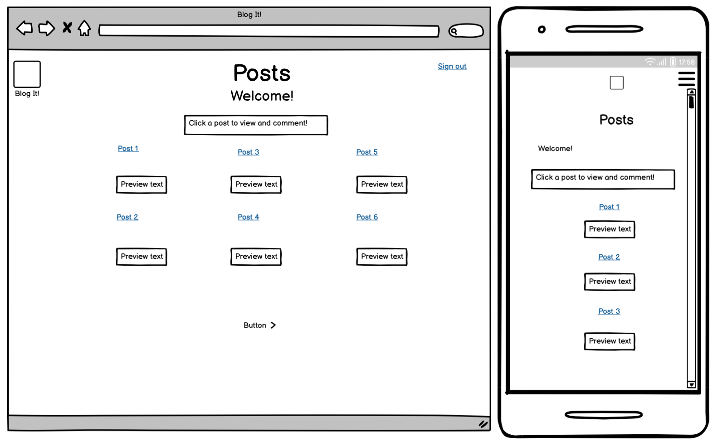
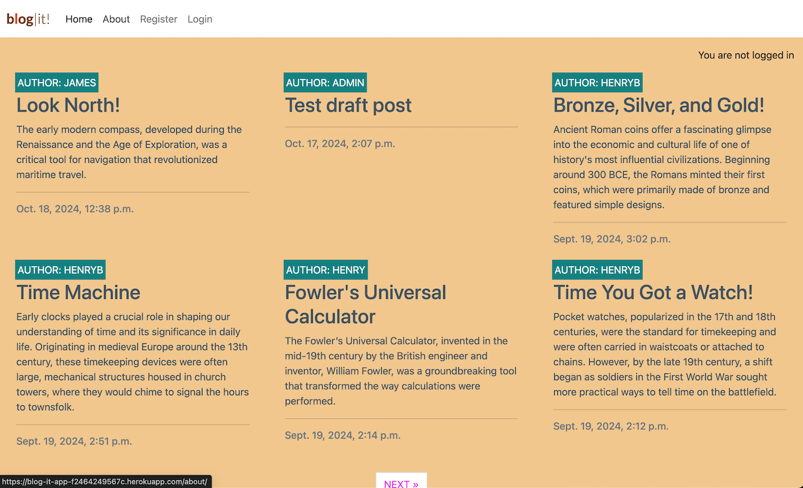
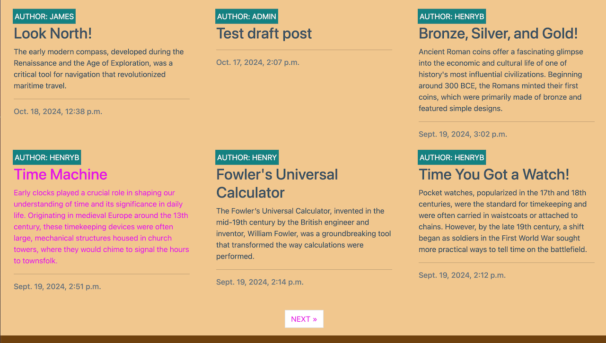
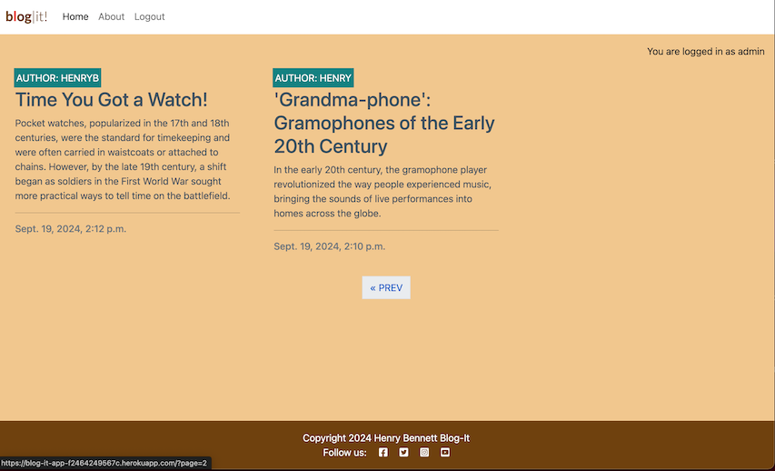
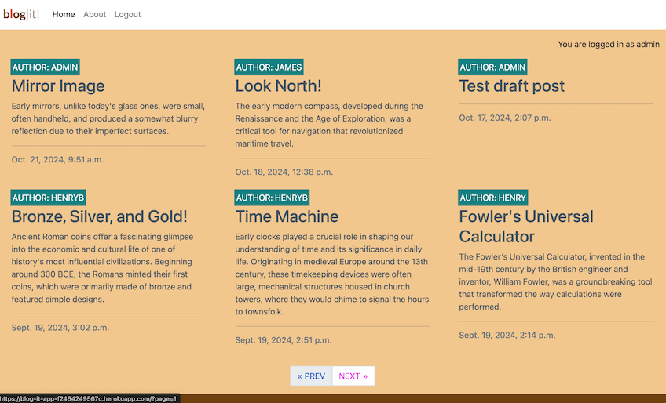

# Blog It!

Deployment link: (https://blog-it-app-f2464249567c.herokuapp.com/)

Github Repository: (https://github.com/henrybennett94/Blog-It)

Welcome to Blog It! Whether you're a seasoned collector or simply curious about the charm of vintage finds, join us as we explore the world of antiques, share tips for restoration and care, and connect with fellow enthusiasts who appreciate the artistry and nostalgia of yesteryear. Let’s uncover the past together!

## Table of Contents

- [Introduction](#introduction)
- [UX Design](#ux-design)
- [Agile Development](#agile-development)
- [Technology Used](#technology-used)
- [Deployment](#deployment)
- [Features](#features)
- [Testing](#testing)
- [Credits](#credits) 
------

## Introduction

Blog It! is a Django web application, intended to give users a streamlined platform for making, updating and managing posts that celebrate the beauty and history of treasured relics from the past! The intended audience is for people with an interest in historical antiques and artifacts, from any period, so that they have a dedicated online space to celebrate this passion by reading and/or posting about. In this way, the application is intended to have full CRUD functionality and user authentication, meaning users of the service can create their own account on the application, on which they have the agency to create, update, and delete posts and comments as logged-in users.

------

## UX Design

### MVP

The MVP provides users with an interest in the subject, though anyone is welcome to join, with an application they can quickly sign up with, and then use to create and read about interesting facts and stories related to different historical antiques, with the option to comment on other account-holders' posts, and delete and edit these comments.

### User Stories for Blog It!:

1. As a site user I can view a paginated list of posts so that I can select which post I want to view.
2. As a site user I can access my user account through a login form requiring a password so that my account's security is maintained.
3. As a site user I can create a user account with a username and password so that access to how I use the site is private to me and protected.
4. As a site user I can get asked to confirm that I wish to delete a feature, after selecting a delete option so that the risk of accidentally deleting something is minimised.
5. As a site user I can leave comments on a post so that I can be involved in the conversation.
6. As a site admin I can approve or disapprove comments so that I can filter out objectionable comments.
7. As a site user or admin I can view comments on an individual post so that I can read the conversation.
8. As a site user I can have the option to delete my posts and comments that I no longer need there so that I can keep my user space organised, updated and relevant.
9. As a site user I can click on a post so that I can read the full text.
10. As a site admin I can create draft posts so that I can finish writing the content later.
11. As a site admin I can create, read, update and delete posts so that I can manage my blog content.
12. As a site user I can like others' posts so that I can show appreciation for other site users' content.

This application was designed using Balsamiq to create wireframes. The approach of the design was to conform to user stories, utilising a 'Mobile-first' approach to ensure responsivity would be developed and maintained.

### Sample Project Wireframes

  

------

## Agile Development

The project was developed using Agile Methodology. User stories were mapped to a Github Projects project board to chart development progress, with four sections: 'To Do'- the backlog, 'In Progress'- initial developments, and 'Done'- to mark the story as completed. User Stories were also mapped to Issues, listed in the 'Issues' tab in the Github repository, and assigned between three milestones: 'Blog Posts', 'User Authentication', and 'User CRUD'. A fourth milestone, 'Future Features' exists for User Stories that were assigned 'Won't' in MoSCoW prioritisation, but can be developed in future iterations.

### Link to Project Board

https://github.com/users/henrybennett94/projects/7

Project Board

### MoSCoW 

User stories were worked on according to a MoSCoW prioritisation system, assigning four labels ('Must', 'Should', 'Could', 'Won't') to each story to be able to work towards achieving the MVP for this iteration.

| User Story | MoSCoW | Milestone |
| ---------- | ------ | --------- |
| 1          | Must   | Blog Posts|
| 2          | Must   | User Auth |
| 3          | Must   | User Auth |
| 4          | Should | User CRUD |
| 5          | Must   | User CRUD |
| 6          | Could  | Blog Posts|
| 7          | Must   | User CRUD |
| 8          | Must   | User CRUD |
| 9          | Must   | User CRUD |
| 10         | Could  | Blog Posts|
| 11         | Must   | Blog Posts|
| 12         | Won't  | Future Features |

### ERD

Entity Relational Diagrams to demonstrate the structure of the database models.

#### Post model

| KEY         | Entity     | Data        |
|-------------|------------|-------------|
| Primary     | Title      | CharField   |
| Primary     | Slug       | SlugField   |
| ForeignKey  | Author     | User Model  |
| Primary     | Content    | Text        |
| Primary     | Created On | DateTime    |
| Primary     | Status     | Integer     |
| Primary     | Excerpt    | Text        |
| Primary     | Updated On | DateTime    |

#### Comment model

| KEY         | Entity     | Data        |
|-------------|------------|-------------|
| ForeignKey  | Post       | Post Model  |
| ForeignKey  | Author     | User Model  |
| Primary     | Body       | Text        |
| Primary     | Approved   | Boolean     |
| Primary     | Created On | DateTime    |

#### About model

| KEY         | Entity     | Data        |
|-------------|------------|-------------|
| Primary     | Title      | CharField   |
| Primary     | Content    | Text        |
| Primary     | Updated On | DateTime    |

------

## Technology used
Blog It! leverages several modern web development technologies, with the intention to create an engaging and interactive user experience. The key technologies used are Python, HTML CSS, JavaScript, Django, and Cloudinary.

### Python
Python is an object-oriented general purpose programming language used popularly in supporting web development. Using Python in a Django project enables the creation of powerful web applications by leveraging Django's high-level framework for clean, scalable, and maintainable code.
### HTML
HTML (HyperText Markup Language) is the standard markup language used to create the structure of the web pages in this application. It provides the skeleton for the app's interface, defining elements such as buttons, images, and text content.
### CSS
CSS (Cascading Style Sheets) is used for styling the HTML elements. It enhances the visual presentation of the app by controlling the layout, colors, fonts, and overall look and feel.
### JavaScript
JavaScript enhances a Django application by enabling dynamic, interactive user interfaces, streamlining the development process.
### Django
Django is a Python web framework ideal for projects due to its robust scalability, offering rapid development, built-in security features, and a clean, pragmatic design. Its capabilities facilitate a well-structured development environment and enable a straightforward interface between application and database. 
### Cloudinary
Cloudinary is a cloud-based service that provides powerful tools for managing, optimizing, and delivering images and videos in web and mobile applications. Offering seamless media management and optimized delivery, it is an expedient tool for storing media in a Django application.

------
## Deployment

- The site was deployed to Heroku. The steps to deploy are as follows: 
  - Log in to herokuapp.com
  - From the Heroku dashboard, navigate to "New", and from the dropdown select "Create new app"
  - Choose a unique app name and select region, create app ("blog-it-app")
  - In the Heroku blog-it-app go to the Settings tab, reveal Config Vars and set the necessary keys and        values
  - Go to the Deploy tab, go to "Deployment Method" section and select Github
  - Search for and then select the relevant Github repository (https://github.com/henrybennett94/Blog-It), to connect it with the Heroku app
  - Navigate to the "Manual deploy" section, ensure the main branch is selected for deployment, and then select "Deploy"
  - Wait for the app to build in Heroku
  - Select "View" on completion of build
  - The deployed link can be found at: (https://blog-it-app-f2464249567c.herokuapp.com/)

### Accessing code

The application source code can be accessed at the Github repository (https://github.com/henrybennett94/Blog-It). To run the code from this repository, developers can clone the repository locally, open in an IDE
and then install dependencies by navigating to the project folder and running terminal command:
  pip install -r requirements.txt

To contribute, developers can fork the repository, create a new branch for their feature, and submit a pull request with a clear description of their changes.
 
------
## Features

### Features implemented:

#### Overview of posts
  
   

#### View Post Details
Users can select a post title to view the full content, including any comments associated with the post.

  

#### User Authentication for Commenting
- Registered users can comment on posts and have full control over their comments, including the ability to create, edit, and delete them.

  

- For non-authenticated users, a prompt to log in will replace the comment form, encouraging them to sign in to leave a comment.
- Users who have posted a comment can edit or delete their comment by selecting the respective options beneath the comment.
- All comments submitted by logged-in users require approval from the site administrator before becoming publicly visible.

  

#### Draft Creation for Superusers
Superusers can create new posts and save them as drafts via the admin panel. This allows them to review and revise content before making it publicly available.

#### Manage posts
Superusers can, in the admin panel, create, update, read and delete posts, with changes reflected in the public website.

 

#### 'About' Page
The site includes an 'About' page accessible from the homepage, providing users with information about the site's purpose and goals.

#### Defensive Actions for Deletions
Before deleting a comment or post (for administrators), users are prompted to confirm or cancel the deletion, preventing accidental removal of content.

### Features to implement for future iterations:
- 'Like' button
  - As a site user I can like others' posts so that I can easily show appreciation for other site users' content.

### Possible revisions
- Comment approval required
  - Implement logic to remove requirement for admin approval for all users posting comments.

------
## Testing

### Responsivity

I used the Google Chrome Responsive Viewer Extension to test responsivity across a range of devices. Sample mockups of the application in desktop, tablet, and smartphone view:

#### Desktop View

#### Tablet View, Smartphone View

 

### Code Validation

#### HTML
I ran the HTML source code from the deployed site through the W3 HTML Validator.

I ran my CSS script through the Jigsaw W3C CSS Validation Service.

I ran all my Python scripts through the CI Python Linter, and resolved any issues so that it meets Pep8 standards.

### Manual Testing

#### Navigation Links
- Expected: Navigation links in the menu should redirect users to the corresponding pages (Home, About, Register, Login) when clicked. When hovering over these links, they should change from grey to bold, except for the current page, which is always bold.

- Testing Method: Hovered over the navigation titles ('Home', 'About', 'Register', 'Login'). Verified that titles changed from grey to bold on hover, with the exception of the current page. Clicked on the links to check redirection.
  
- Result: Users were successfully redirected to the following URLs:

  - https://blog-it-app-f2464249567c.herokuapp.com/ 'Home'
  - https://blog-it-app-f2464249567c.herokuapp.com/about/ 'About'
  - https://blog-it-app-f2464249567c.herokuapp.com/accounts/signup/ 'Register'
  - https://blog-it-app-f2464249567c.herokuapp.com/accounts/login/ 'Login'
  on completing above action.

 

#### Hover Functionality (text highlighting)
- Expected: Hovering over post titles and preview text should highlight the content, indicating a clickable link to the full post.

- Testing Method: Hovered over post titles and preview text on the homepage.

- Result: The text was highlighted as expected, indicating that it is linked to the full post content.

 

#### Next/Previous and pagination
- Expected: A maximum of 6 posts should be displayed per page. Users should be able to navigate between pages using "NEXT" and "PREV" buttons.

- Testing Method:
  1.	Visited the homepage (https://blog-it-app-f2464249567c.herokuapp.com/?page=1) and clicked the "NEXT >>" button.

  
  
  2.	Repeated the process for different pages.

  
  
   

- Result: Pagination worked as expected.
- Redirected to the correct pages based on the selection.
  
#### Sign Up/Sign In buttons and Success messages/failure prompts
- Expected: After successfully registering or signing in, users should be redirected to the homepage, with appropriate success messages displayed.

- Testing Method:
  1. Registered a new user, filling in the required form fields and clicked "Sign Up."

    

  2. Logged in with the new credentials.
    
- Result: For both actions, the user was redirected to the homepage with success messages ("Successfully signed in as [username]" and "You are logged in as [username]") displayed.

  

#### Defensive functionality-Sign Out and Deletion
(I) Deletion
- Expected: Upon clicking "Delete" for a comment or post (as admin), users should be prompted to confirm or cancel the deletion.

- Testing Method
1. Tested deletion of a comment by selecting "Delete" and cancelling in the modal.
2. Tested deletion of a post as admin and cancelled the action.
 
 

- Result: Both actions were cancelled as expected, with no changes to the content.

  
(II) Sign Out
- Expected: When a user logs out, they should be redirected to a confirmation prompt before signing out.
- Testing Method: Logged out from the navigation bar.
- Result: The user was successfully logged out, and a confirmation prompt was displayed.

 

#### Protection for authenticated users
- Expected: Only authenticated users should be able to submit, edit, or delete comments. Non-authenticated visitors should see a "Log in to leave a comment" message instead.
- Testing Method: Logged out and attempted to comment on a post.
- Result: Non-authenticated users were unable to leave comments, and the "Log in to leave a comment" message was displayed.

#### Password requirements
- Expected: Users must meet the specified password requirements when signing up. Both password fields must match for successful registration.
- Testing Method: Tested both valid and invalid inputs (e.g., weak passwords, mismatched password fields).

- Result: Valid inputs resulted in successful registration, while invalid inputs prompted error messages.

 

#### Button Functionality

(I) Delete Button
- Expected: Clicking "Delete" should prompt a modal asking for confirmation.
- Testing Method: Clicked "Delete" beneath a comment.
- Result: The modal appeared, and the comment was successfully deleted upon confirmation.
  See [Defensive functionality-Sign Out and Deletion](#defensive-functionality-sign-out-and-deletion) for visual.

(II) Edit Button
- Expected: Clicking "Edit" should prepopulate the comment form with the comment text and replace the "Submit" button with an "Update" button.
- Testing Method: Clicked "Edit" beneath a comment.
- Result: The form was prepopulated with the comment text, and the "Update" button replaced the "Submit" button.

   

### Unit Testing
The project includes a suite of unit tests to ensure the functionality of key features, specifically related to blog post details and the comment system. Below is an overview of the provided unit tests:

Test Files

test_views.py: Contains tests for the blog views, including rendering of post details and comment submission.
test_forms.py: Contains tests for the comment form validation.

Blog Views Unit Tests (test_views.py)
test_render_post_detail_page_with_comment_form:

- Verifies that the blog post detail page renders correctly.
- Ensures that the response contains the correct post title, content, and that a CommentForm instance is passed into the context.

test_successful_comment_submission:

- Tests the process of submitting a comment.
- Simulates a logged-in user posting a comment on a blog post.
- Verifies that the comment submission is successful and that the response indicates the comment is awaiting approval.

Comment Form Unit Tests (test_forms.py)
test_form_is_valid:

- Tests whether the CommentForm is valid when provided with a valid comment body.
- Ensures the form passes validation.

test_form_is_invalid:

- Tests the CommentForm when an empty comment body is submitted.
- Verifies that the form is invalid, ensuring proper validation is enforced.

Running the Tests 

Used command:

python manage.py test

in the terminal to execute all the tests and provide feedback on any failures or issues.

Key Test Observations:
Tests involving rendering the post detail page (with comment form) passed, meaning the page loaded without issues, even when no comments were present.
The form validation test, checking if a comment can be successfully submitted and awaiting approval, passed as expected.
Conclusion:
The unit tests confirm that the core features, including the post detail page, comment submission, and comment form validation, are functioning correctly. Since no tests failed, it indicates that the code is stable and free of errors based on the current test coverage.

### Resolved Bugs

#### Paragraph Tag Validation
An HTML validation error was identified in post_detail.html when using the W3C Validator, specifically involving an unclosed 
 tag within the post content section.

Resolution:
To address this, the post content has been wrapped in a 
 element instead of a 
 tag. This change resolves the validation issue while maintaining the intended structure and styling for the content.

### Known Bugs
No other bugs identified after final checking of iteration.
  
------
## Credits
- [Freepik](https://www.freepik.com/)
- [Django Documentation](https://docs.djangoproject.com/en/5.1/)
- [Bootstrap Documenetation](https://getbootstrap.com/docs/5.3/getting-started/introduction/)
- [Google Fonts](https://fonts.google.com/)
- [Fontawesome](https://fontawesome.com/)
- [Chat-GPT](https://openai.com/chatgpt/)
- [W3C MarkUp Validation Service](https://validator.w3.org/)
- [Jigsaw CSS Validator](https://jigsaw.w3.org/css-validator/)
- [CI Python Linter](https://pep8ci.herokuapp.com/)
- Code Institute- "I Think Therefore I Blog"
